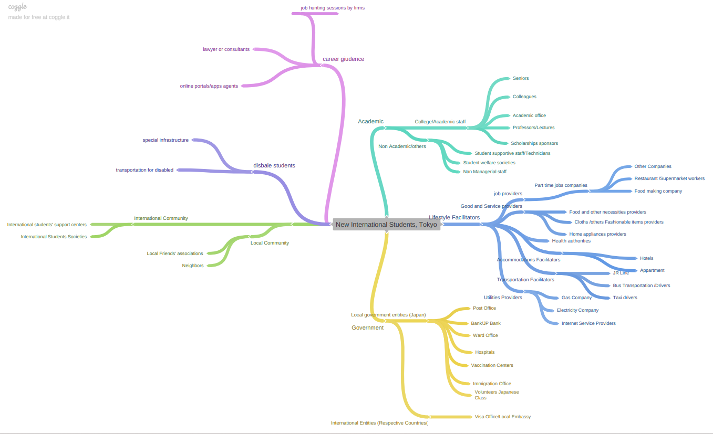
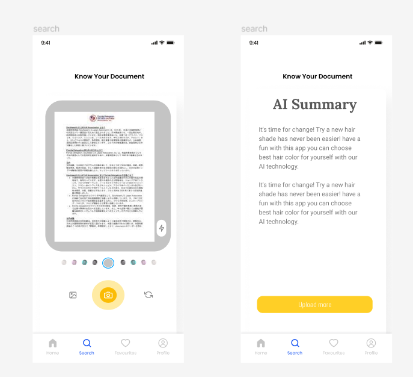

# Dessign-thinking

## Improving life of kyoto International Student;

This Repo solves the given problem using design thinking approach. 
It is five step prcoess not necesserly linear but cyclic  
•       empathize 
•       define 
•	      Ideate 
•	      Prototype 
•	      Test 

### Preview

### PPT
https://github.com/Sharanya98/Dessign-thinking/blob/main/ppt.pptx
